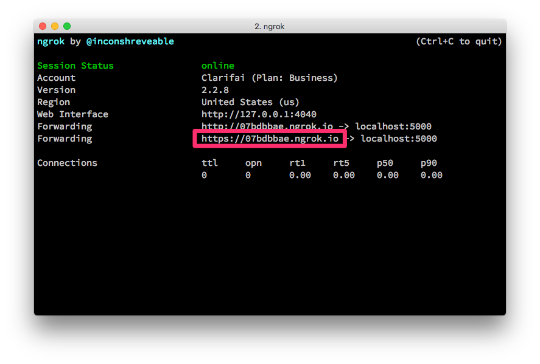
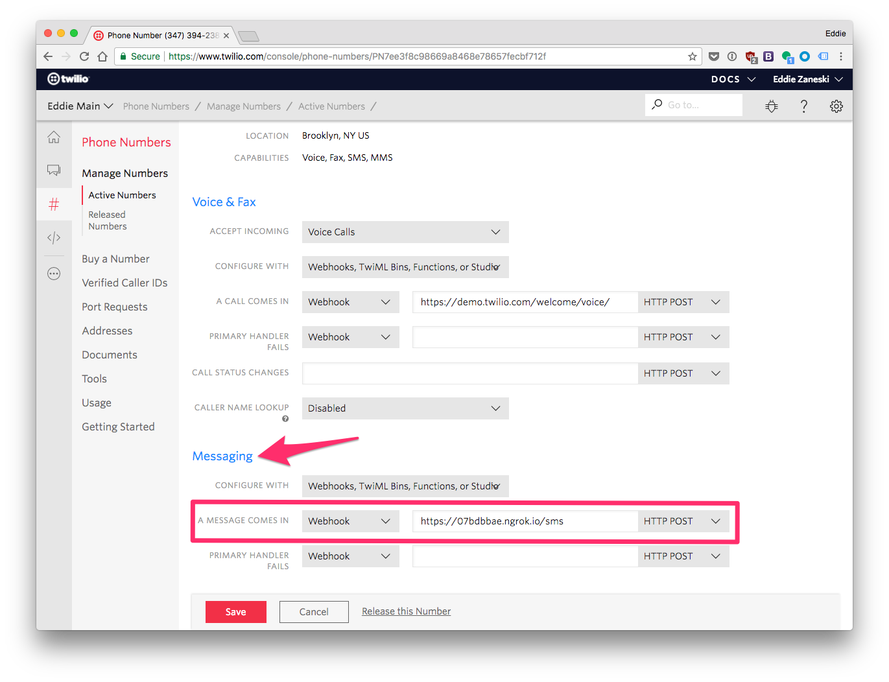
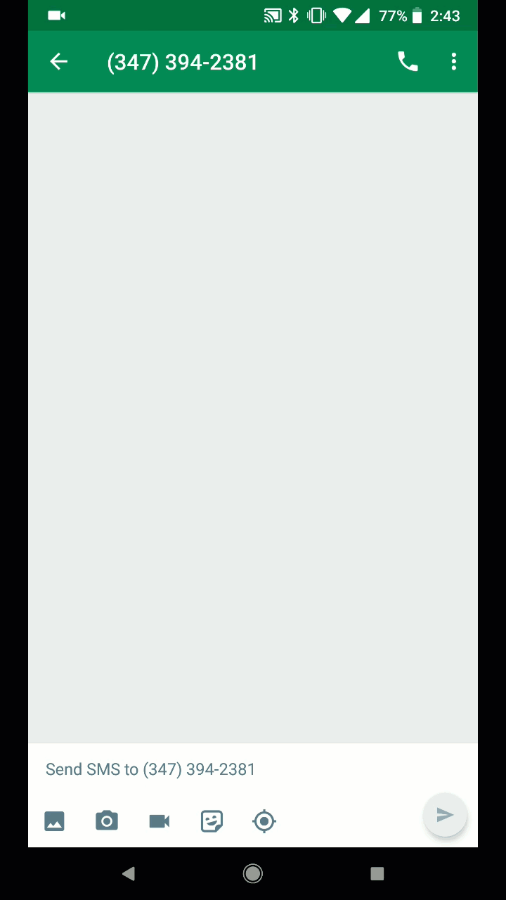

# Quickstart .NET MVC

This is an example project built using the [Clarifai C# API Client](https://github.com/clarifai/clarifai-csharp).

Send an MMS to a [Twilio](https://twilio.com) phone number and receive an SMS back with the Clarifai predicted concepts.

## Requirements

* [.NET Core SDK](https://www.microsoft.com/net/download/)
* A Clarifai account - [sign up for free](https://clarifai.com/developer/account/signup?utm_source=github&utm_medium=readme&utm_campaign=clarifai%2Fquickstart-dotnet-mvc)
* A Twilio account - [sign up for free](https://www.twilio.com/try-twilio).
* [ngrok](https://ngrok.com/)

## Getting Started

Clone the repo and install the dependencies.

```bash
git clone git@github.com:Clarifai/quickstart-csharp-mvc-twilio.git
cd quickstart-csharp-mvc-twilio
dotnet restore
```

Grab your Clarifai API Key from the [developer console](https://clarifai.com/developer/account/keys) and set the `CLARIFAI_API_KEY` environment variable with it. Alternatively you can hardcode it in the `Controllers/SmsController.cs` file.

Start up ngrok and copy your ngrok URL.

```
ngrok http 5000
```



Buy an MMS capable Twilio Phone Number at [https://www.twilio.com/console/phone-numbers/search](https://www.twilio.com/console/phone-numbers/search).

Configure the phone number's inbound **Messaging** webhook by pasting in your ngrok URL. Make sure to click **Save**.



Start up the app and send an MMS picture message to your Twilio Phone Number.

```bash
dotnet run
```

